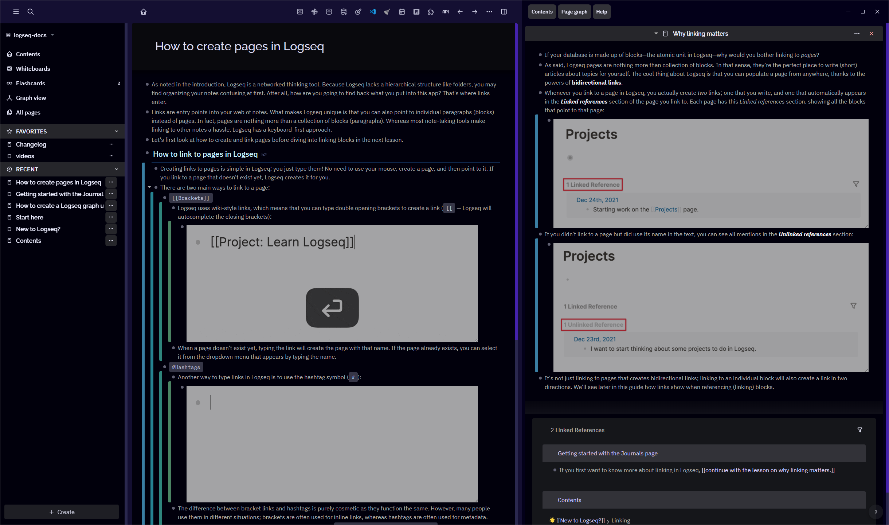

# Logseq PolyRhythmic

A theme based off [Hugo PolyRhythmic](https://github.com/wonyoung-jang/hugo-PolyRhythmic), a theme based off Google's Material Design 3.

## Screenshots

## Install

1. Open Logseq
2. Go to Plugins
3. Hit Marketplace
4. Search for "PolyRhythmic"